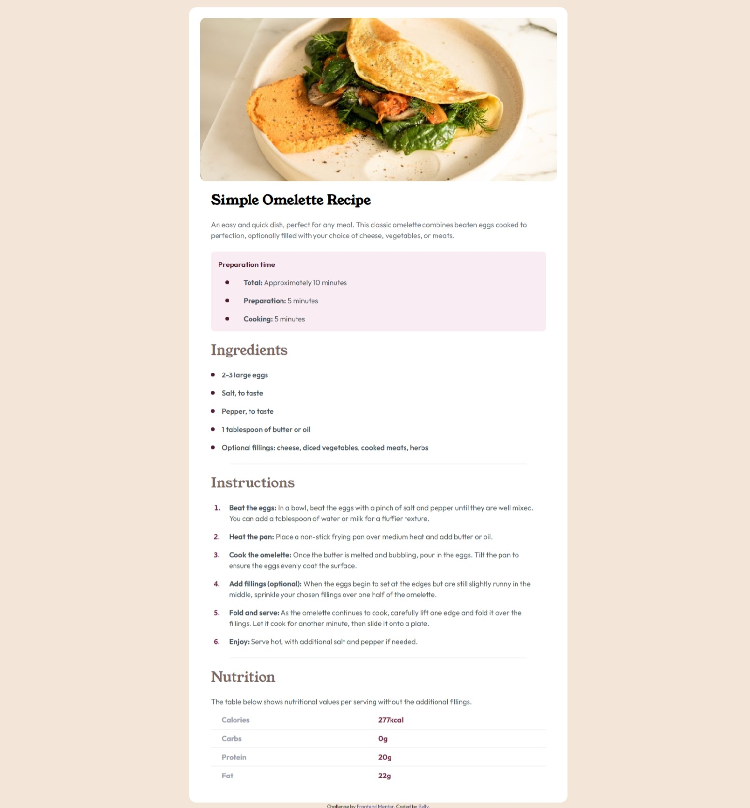
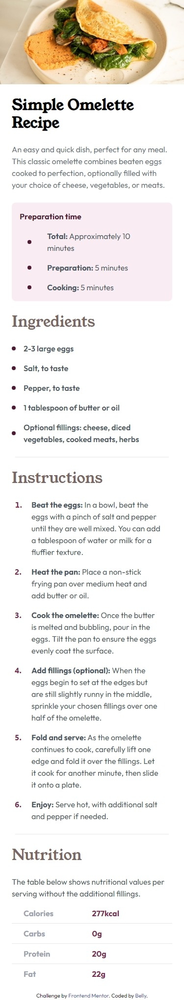

# Frontend Mentor - Social links profile solution

This is a solution to the [Social links profile challenge on Frontend Mentor](https://www.frontendmentor.io/challenges/social-links-profile-UG32l9m6dQ). Frontend Mentor challenges help you improve your coding skills by building realistic projects.

## Table of contents

- [Overview](#overview)
  - [The challenge](#the-challenge)
  - [Screenshot](#screenshot)
  - [Links](#links)
- [My process](#my-process)
  - [Built with](#built-with)
  - [Useful resources](#useful-resources)
- [Author](#author)

**Note: Delete this note and update the table of contents based on what sections you keep.**

## Overview

### The challenge

Users should be able to:

- See hover and focus states for all interactive elements on the page

### Screenshot

### Links

- Solution URL: [solution URL here]([https://github.com/Belly606/social-links-profile](https://github.com/Belly606/Recipe-page))
- Live Site URL: [live site URL here]([https://belly606.github.io/social-links-profile/](https://belly606.github.io/Recipe-page/))

## My process

### Built with

- Semantic HTML5 markup
- CSS custom properties
- Flexbox
- CSS Grid
- Mobile-first workflow
- [Tailwind](https://tailwindcss.com/) - CSS Framework

### Useful resources

- [Elzero HTML Course](https://elzero.org/study/html-2021-study-plan/) - This helped me for Understanding HTML & Make it a piece of Cake for me. I really appreciate he instructor so much.
- [Elzero CSS Course](https://elzero.org/study/css-2021-study-plan/) - This helped me for Understanding CSS & Make it a piece of Cake for me. I really appreciate he instructor so much.
- [Tailwind CSS Course](https://www.youtube.com/playlist?list=PLnD96kXp-_pMR9cBUmvsz_kIIt9bv2UIP) - This is an amazing course which helped me finally understand How Tailwind CSS Works. I'd recommend it to anyone still learning this concept.

## Author

- Github - [Belly](https://github.com/Belly606)
- Frontend Mentor - [@Belly606](https://www.frontendmentor.io/profile/Belly606)
